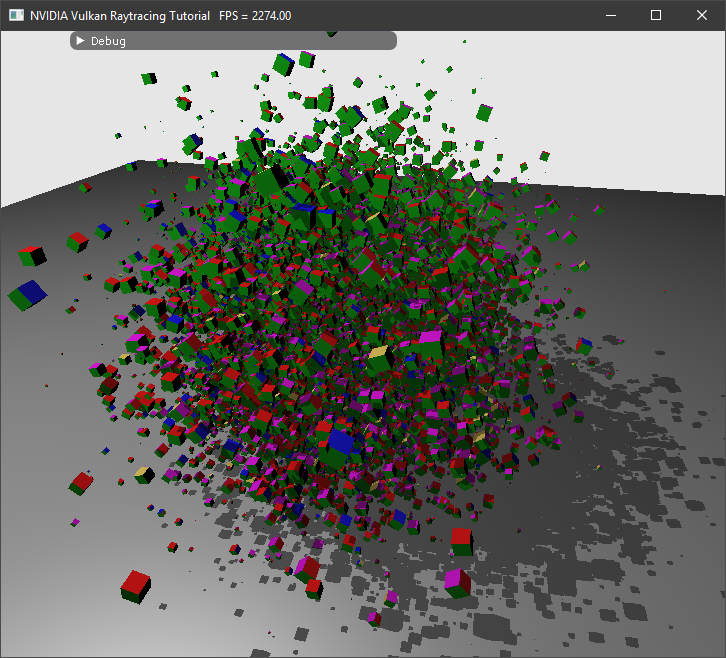
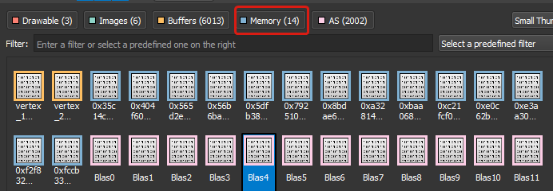
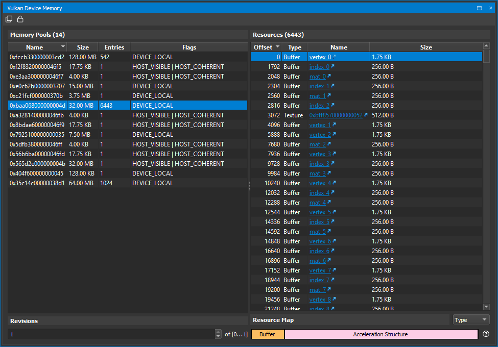

# NVIDIA Vulkan Ray Tracing Tutorial

## Tutorial ([Setup](../docs/setup.md))

This is an extension of the Vulkan ray tracing [tutorial](https://nvpro-samples.github.io/vk_raytracing_tutorial_KHR).

Ray tracing can easily handle having many object instances at once. For instance, a top level acceleration structure can
have many different instances of a bottom level acceleration structure. However, when we have many different objects, we
can run into problems with memory allocation. Many Vulkan implementations support no more than 4096 allocations, while
our current application creates 4 allocations per object (Vertex, Index, and Material), then one for the BLAS. That
means we are hitting the limit with just above 1000 objects.

(insert setup.md.html here)

## Many Instances

First, let's look how the scene would look like when we have just a few objects, with many instances.

In `main.cpp`, add the following includes:

~~~~ C++
#include <random>
~~~~

Then replace the calls to `helloVk.loadModel` in `main()` by

~~~~ C++
  // Creation of the example
  helloVk.loadModel(nvh::findFile("media/scenes/cube.obj", defaultSearchPaths, true));
  helloVk.loadModel(nvh::findFile("media/scenes/cube_multi.obj", defaultSearchPaths, true));
  helloVk.loadModel(nvh::findFile("media/scenes/plane.obj", defaultSearchPaths, true));

  std::random_device              rd;  // Will be used to obtain a seed for the random number engine
  std::mt19937                    gen(rd());  // Standard mersenne_twister_engine seeded with rd()
  std::normal_distribution<float> dis(1.0f, 1.0f);
  std::normal_distribution<float> disn(0.05f, 0.05f);

  for(int n = 0; n < 2000; ++n)
  {
    HelloVulkan::ObjInstance inst;
    inst.objIndex       = n % 2;
    inst.txtOffset      = 0;
    float         scale = fabsf(disn(gen));
    nvmath::mat4f mat =
        nvmath::translation_mat4(nvmath::vec3f{dis(gen), 2.0f + dis(gen), dis(gen)});
    mat              = mat * nvmath::rotation_mat4_x(dis(gen));
    mat              = mat * nvmath::scale_mat4(nvmath::vec3f(scale));
    inst.transform   = mat;
    inst.transformIT = nvmath::transpose(nvmath::invert((inst.transform)));
    helloVk.m_objInstance.push_back(inst);
  }
~~~~

 **Note:**
    This will create 3 models (OBJ) and their instances, and then add 2000 instances 
    distributed between green cubes and cubes with one color per face.

## Many Objects

Instead of creating many instances, create many objects.

Remove the previous code and replace it with the following

~~~~ C++
  // Creation of the example
  std::random_device              rd;  //Will be used to obtain a seed for the random number engine
  std::mt19937                    gen(rd());  //Standard mersenne_twister_engine seeded with rd()
  std::normal_distribution<float> dis(1.0f, 1.0f);
  std::normal_distribution<float> disn(0.05f, 0.05f);
  for(int n = 0; n < 2000; ++n)
  {
    helloVk.loadModel(nvh::findFile("media/scenes/cube_multi.obj", defaultSearchPaths, true));
    HelloVulkan::ObjInstance& inst = helloVk.m_objInstance.back();

    float         scale = fabsf(disn(gen));
    nvmath::mat4f mat =
        nvmath::translation_mat4(nvmath::vec3f{dis(gen), 2.0f + dis(gen), dis(gen)});
    mat              = mat * nvmath::rotation_mat4_x(dis(gen));
    mat              = mat * nvmath::scale_mat4(nvmath::vec3f(scale));
    inst.transform   = mat;
    inst.transformIT = nvmath::transpose(nvmath::invert((inst.transform)));
  }

  helloVk.loadModel(nvh::findFile("media/scenes/plane.obj", defaultSearchPaths, true));
~~~~

The example might still work, but the console will print the following error after loading 1363 objects. All other objects allocated after the 1363rd will fail to be displayed.

Error | Error: VUID_Undefined Number of currently valid memory objects is not less than the maximum allowed (4096).
-|-
Note |   This is the best case; the application can run out of memory and crash if substantially more objects are created (e.g. 20,000)

## Device Memory Allocator (DMA)

It is possible to use a memory allocator to fix this issue.

### `hello_vulkan.h`

In `hello_vulkan.h`, add the following defines at the top of the file to indicate which allocator to use

~~~~ C++
// #VKRay
//#define ALLOC_DEDICATED
#define ALLOC_DMA
~~~~

Replace the definition of buffers and textures and include the right allocator.

~~~~ C++
#if defined(ALLOC_DEDICATED)
#include "nvvk/allocator_dedicated_vk.hpp"
using nvvkBuffer  = nvvk::BufferDedicated;
using nvvkTexture = nvvk::TextureDedicated;
#elif defined(ALLOC_DMA)
#include "nvvk/allocator_dma_vk.hpp"
using nvvkBuffer  = nvvk::BufferDma;
using nvvkTexture = nvvk::TextureDma;
#endif
~~~~

And do the same for the allocator

~~~~ C++
#if defined(ALLOC_DEDICATED)
  nvvk::AllocatorDedicated m_alloc;  // Allocator for buffer, images, acceleration structures
#elif defined(ALLOC_DMA)
  nvvk::AllocatorDma            m_alloc;  // Allocator for buffer, images, acceleration structures
  nvvk::DeviceMemoryAllocator   m_memAllocator;
  nvvk::StagingMemoryManagerDma m_staging;
#endif
~~~~

### `hello_vulkan.cpp`

In the source file there are also a few changes to make.

DMA needs to be initialized, which will be done in the `setup()` function:

~~~~ C++
#if defined(ALLOC_DEDICATED)
  m_alloc.init(device, physicalDevice);
#elif defined(ALLOC_DMA)
  m_memAllocator.init(device, physicalDevice);
  m_memAllocator.setAllocateFlags(VK_MEMORY_ALLOCATE_DEVICE_ADDRESS_BIT_KHR, true);
  m_staging.init(m_memAllocator);
  m_alloc.init(device, m_memAllocator, m_staging);
#endif
~~~~

The RaytracerBuilder was made to allow various allocators, therefore nothing to change in the call to `m_rtBuilder.setup()`

### Destruction

The VMA allocator need to be released in `HelloVulkan::destroyResources()` after the last `m_alloc.destroy`.

~~~~ C++
#if defined(ALLOC_DMA)
  m_dmaAllocator.deinit();
#endif
~~~~

## Result

Instead of thousands of allocations, our example will have only 14 allocations. Note that some of these allocations are allocated by Dear ImGui, and not by DMA. These are the 14 objects with blue borders below:

Finally, here is the Vulkan Device Memory view from Nsight Graphics:

## VMA: Vulkan Memory Allocator

We can also modify the code to use the [Vulkan Memory Allocator](https://github.com/GPUOpen-LibrariesAndSDKs/VulkanMemoryAllocator) from AMD.

Download [vk_mem_alloc.h](https://github.com/GPUOpen-LibrariesAndSDKs/VulkanMemoryAllocator/blob/master/src/vk_mem_alloc.h) from GitHub and add this to the `shared_sources` folder.

There is already a variation of the allocator for VMA, which is located under [nvpro-samples](https://github.com/nvpro-samples/shared_sources/tree/master/nvvk). This allocator has the same simple interface as the `AllocatorDedicated` class in `allocator_dedicated_vkpp.hpp`, but will use VMA for memory management.

VMA might use dedicated memory, which we do, so you need to add the following extension to the 
creation of the context in `main.cpp`.

~~~~ C++
  contextInfo.addDeviceExtension(VK_KHR_BIND_MEMORY_2_EXTENSION_NAME);
~~~~  

### hello_vulkan.h

Follow the changes done before and add the following

~~~~ C++
#define ALLOC_VMA
~~~~ 

~~~~ C++
#elif defined(ALLOC_VMA)
#include "nvvk/allocator_vma_vk.hpp"
using nvvkBuffer  = nvvk::BufferVma;
using nvvkTexture = nvvk::TextureVma;
~~~~

~~~~ C++ 
#elif defined(ALLOC_VMA)
  nvvk::AllocatorVma            m_alloc;  // Allocator for buffer, images, acceleration structures
  nvvk::StagingMemoryManagerVma m_staging;
  VmaAllocator                  m_memAllocator;
~~~~

### hello_vulkan.cpp
First, the following should only be defined once in the entire program, and it should be defined before `#include "hello_vulkan.h"`:

~~~~ C++
#define VMA_IMPLEMENTATION
~~~~

In `setup()`

~~~~ C++
#elif defined(ALLOC_VMA)
  VmaAllocatorCreateInfo allocatorInfo = {};
  allocatorInfo.instance               = instance;
  allocatorInfo.physicalDevice         = physicalDevice;
  allocatorInfo.device                 = device;
  allocatorInfo.flags                  = VMA_ALLOCATOR_CREATE_BUFFER_DEVICE_ADDRESS_BIT;
  vmaCreateAllocator(&allocatorInfo, &m_memAllocator);
  m_staging.init(device, physicalDevice, m_memAllocator);
  m_alloc.init(device, m_memAllocator, m_staging);
~~~~

In `destroyResources()`

~~~~ C++
#elif defined(ALLOC_VMA)
  vmaDestroyAllocator(m_vmaAllocator);
~~~~

